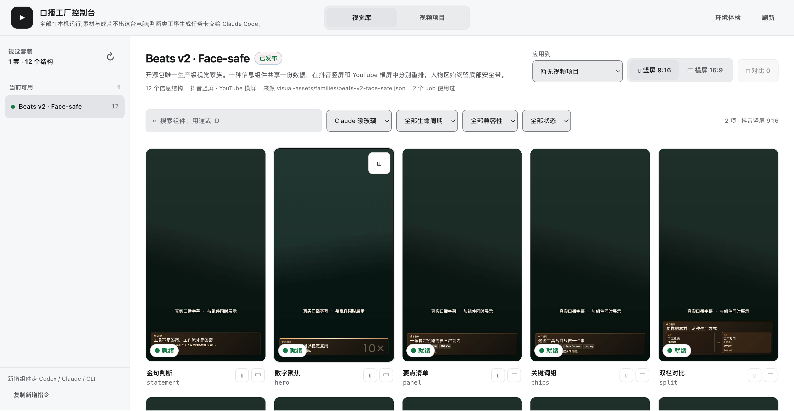

# 口播工厂 · Talking Head Video Factory

> 「50 天 50 个真实行业 AI 应用」· Day 02 · 创作者服务 · MIT
> [](https://github.com/scotti1i/talking-head-factory-automation-day02/actions/workflows/ci.yml)

把一条口播原片变成可发布成片的完整流水线：**词级转录 → 语义精剪 → 逐切点 QA → 字幕 → 信息卡包装 → 同一份数据派生竖屏/横屏 → 最终 MP4 QA → Shorts → 交付**。它替代的是剪口播时那套重复劳动——不是替你写内容，而是把"剪、包、检、交"变成可复跑、可检查的确定性工序。

分工只有一条：**AI（Claude Code / Codex）做语义判断，仓库脚本做确定性执行**，两者之间靠 [`docs/data-contract.md`](docs/data-contract.md) 的数据文件说话。生成的 HTML、MP4、截图永远是产物，不是编辑输入。



## 一条事实链

```text
原片（只读，永不覆盖）
  → 素材清单 + 按哈希缓存的词级转录（一份转录同时服务剪辑和字幕）
  → 语义 EDL（每个保留段有理由，不用静音检测凑）
  → 干净 A-roll + 逐切点电影条/波形 QA（必须逐张看过才能批准）
  → 同一缓存重映射字幕
  → beats 信息卡 + 有理由的 B-roll（保留说话人小窗）
  → 同一 builder 派生竖屏 / 横屏（不是硬裁）
  → 最终 MP4 抽帧 QA + Shorts stream copy + 交付
```

## 30 秒跑起来（零真实素材）

需要 Node.js ≥ 22、npm、ffmpeg。macOS 和 Windows 都可以（见下「跨平台」）。

```bash
npm ci
npm run doctor        # 环境自检：core 必须全绿；whisper 属可选档
npm run smoke         # 合成素材 → 构建 → 静态检查，全链演示
npm run sample        # 82 秒模板巡礼：10 种信息卡逐一亮相
npm run console       # 打开 http://127.0.0.1:4870 看视觉库
```

`smoke` / `sample` / `regression` 的素材全部由 ffmpeg 现场合成——**这是演示，不是产品效果**。它证明的是：你拿到的这条流水线在你机器上真的能跑通全链。

## 演示与真实使用的边界（先说清楚）

- **演示（上面四条命令）**：零密钥、零真实素材，验证链路本身。合成的渐变底、正弦音、示例文案不代表任何真实成片。
- **真实使用**：把你的口播原片放进 `jobs/<slug>/assets/originals/`，需要两样东西：
  1. **whisper-cli**（词级转录）——macOS `brew install whisper-cpp`；Windows 用 [whisper.cpp releases](https://github.com/ggml-org/whisper.cpp/releases) 预编译包。模型路径用 `WHISPER_MODEL` 环境变量或 `--model` 参数指定。`npm run doctor` 会告诉你缺什么、怎么装。
  2. **一个会做判断的 AI 入口**（见下节）——语义精剪、字幕校准、B-roll 取舍是判断活，脚本只负责执行判断结果。

没有 whisper 时，转录之外的所有工序（构建、派生、QA、渲染、交付）照常可用；你也可以导入现成的词级转录 JSON（合同见 [`EXTENDING.md`](EXTENDING.md)）。

## 用 Claude Code 或 Codex 当智能入口

仓库自带 `skills/talkinghead-edit`（语义剪辑判断层），一条命令装进你的 CLI：

```bash
node scripts/install-skills.mjs      # 自动检测并安装到 ~/.claude/skills 和/或 ~/.codex/skills
```

然后对 Claude Code 或 Codex 说：

> 用 talkinghead-edit 把这个口播原片做成抖音竖屏和 YouTube 横屏成片。

它会接管判断类工序（保留哪些段、字幕术语、信息卡节奏、B-roll 取舍），并调用本仓库的确定性命令执行。两家 CLI 的差异与手动安装方式见 [`skills/README.md`](skills/README.md)。没有这两个 CLI 也能用：所有工序都是普通 npm 命令，判断部分你自己做。

## 跨平台

| 平台 | 状态 |
|---|---|
| macOS | 本机全链真实验证（构建、渲染、QA、交付、控制台） |
| Windows | GitHub Actions `windows-latest` 真实跑通 doctor + 单测 + smoke + 回归（见 CI 徽章） |

工程上的跨平台处理：路径全走 `fileURLToPath`/`path.join`；npm/python/hyperframes 的平台可执行名统一在 `scripts/lib.mjs` 收口；磁盘检查用 `fs.statfsSync`（不依赖 `df`）；符号链接在 Windows 降级为 junction/复制。macOS 可用 `npm run app` 打包本地 .app；Windows 用 `npm run app:win` 生成启动器。

## 完整管线（14 道工序）

| 阶段 | 命令 |
|---|---|
| 环境自检 | `npm run doctor` |
| 建 job | `npm run new -- <slug>` |
| 素材清单 | `npm run inventory -- --job jobs/<slug>` |
| 词级转录（哈希缓存） | `npm run transcribe:editor -- --job jobs/<slug>` |
| 语义粗剪渲染 | 写 `data/rough-cut-edl.json` → `npm run roughcut:render -- --job jobs/<slug>` |
| 切点 QA | `npm run qa:cuts` → 逐张看 → `npm run qa:cuts:approve` |
| 字幕 | `npm run captions:build -- --job jobs/<slug>` |
| 构建合成 | `npm run build:beats -- --job jobs/<slug>` |
| 派生双画幅 | `npm run build:variants` / `check:variants` |
| 渲染 | `npm run render:variants` |
| 最终 QA | `npm run qa` → `npm run qa:final:approve` |
| Shorts | `npm run cut:shorts -- --job jobs/<slug>` |
| 交付 | `npm run deliver:variants -- --job jobs/<slug>` |
| 进度 | `npm run status -- --job jobs/<slug>` |

每道工序读什么写什么，见 [`EXTENDING.md`](EXTENDING.md) 的架构地图与 [`docs/data-contract.md`](docs/data-contract.md)。

## 视觉系统：7 套主题 × 10 种信息卡

- **主题**（`themes/`）：warm-glass（默认）、warm-minimal、pastel-ledger、field-notes、signal-yellow、steel-blueprint、neon-forest。每套 = 约 30 个设计 token + 可选 overrides.css，只从 `themes/registry.json` 白名单选，不逐条视频手搓配色。
- **信息卡组件**（`components/`）：statement / hero / panel / chips / split / duel / trio / pipeline / diagram / cta，固定四件套合同，目录扫描自动发现——加第 11 个组件不用改任何名单。
- **控制台**（`npm run console`）：视觉库按家族浏览组件真实渲染预览，竖横屏独立筛选。预览是**本机真实渲染**出来的，首次打开先生成：

```bash
npm run visual:previews -- --theme warm-glass   # 默认主题全组件，几分钟
```

## 回归基线（改 builder / 主题后必跑）

```bash
npm run regression
```

脚本合成一个覆盖 6 种组件、10 条字幕、2 段 B-roll 的基准 job，构建竖屏 + 横屏并通过全部静态检查（0 errors / WCAG AA / 0 layout issues）。全部素材现场合成，随时重建，不携带任何真实视频。

## 二次开发

三个最常见的改造入口，详见 [`EXTENDING.md`](EXTENDING.md)：

1. **加一种信息卡**：`components/<id>/` 四件套，自动发现（[`docs/component-authoring.md`](docs/component-authoring.md)）。
2. **加一套主题**：截图 → 拆版式语言 → 落 tokens → 注册（[`docs/theme-replication.md`](docs/theme-replication.md)）。
3. **换转录引擎**：替换一处 shell-out，守住词级 JSON 合同即可，下游全部不动。

## 边界红线

- 原片永远只读保留；生成物不是编辑输入。
- 不用静音检测替代语义剪辑；每个保留段要有理由。
- 一份词级转录同时服务剪辑和字幕，不重复跑模型。
- B-roll 前 3 秒默认不用、单段 ≤10 秒、总占比 ≤25%、默认保留说话人小窗。
- 切点 QA 和最终 QA 必须看真实产物（逐张切点图、抽帧 MP4），不许盲批。
- 发布不在本仓库承诺范围：流水线产出核查过的 MP4 即止，上传工具自己接。

## 技术栈

Node.js ≥ 22（纯 ESM，唯一 npm 依赖 [hyperframes](https://www.npmjs.com/package/hyperframes)，锁 0.5.6）+ ffmpeg + 可选 whisper-cli。控制台是零框架的本地 HTTP 服务。渲染由 hyperframes 驱动本机 headless Chrome 完成，一切都在你自己的电脑上，素材与成片不出本机。

## License

MIT。示例文案与合成素材可自由使用；你自己 job 里的原片、转录与成片是你的内容，`.gitignore` 默认把整个 `jobs/` 挡在版本管理之外。
